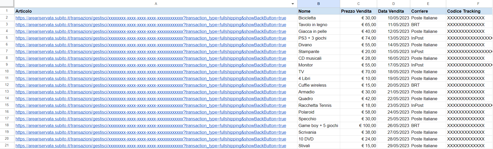

# Subito-it-Articoli-Venduti
Script per estrarre dalle email le vendite effettuate su Subito.it e stamparle su un foglio Google Sheets.

Nella sezione "Vendite" su Subito.it non è possibile vedere tutte le vendite effettuate, ma solo alcune delle più recenti.
Con questo semplice script di Google Apps Script è possibile leggere tutte le email sulla nostra posta di Gmail arrivate da Subito.it e relative alle notifiche delle vendite, estrarre il link della transazione di Subito, il nome dell'articolo, il prezzo, la data di vendita, il corriere utilizzato, il codice di tracking del pacco e il link di tracking del corriere e stampare questi dati su un foglio Google Sheet.

Foglio Google Sheets con script: 

https://docs.google.com/spreadsheets/d/11bAUi7g_xZ6w5GxMk8PvxRkrxz3_gufiKrjTFrJ8gO0/copy

## Utilizzo

Dopo aver creato una copia del foglio, per far partire lo script basta andare sulla toolbar in alto e cliccare sull'opzione "Articoli Subito" > "Leggi articoli venduti". 
La prima volta che si lancia lo script sarà necessario concedere le autorizzazzioni per poter leggere le email.

### Note:

- Lo script utilizza la piattaforma di Google Apps Script e funziona solo sulla casella di posta Gmail. Nel caso si utilizzi un altro provider per l'account di Subito, è possibile inoltrare le relative email in una posta di Gmail per poi poter eseguire questo script (In questo caso sarà necessaria una piccola modifica nello script, nella riga 12 e 46 dove viene effettuata la ricerca delle email).
- Lo script estrae anche le transazioni non andate a buon fine, ovvero quando si vende un oggetto ma il compratore non ritira il pacco e quindi torna indietro al venditore, non completando la vendita
- Lo script estrae solo le transazioni le cui email sono ancora presenti nella casella di posta Gmail, quindi se sono state cancellate alcune email arrivate da subito il risultato dell'estrazione non rispecchierà tutte le vendite effettivamente eseguite
- Google Apps Script prevede dei limiti di tempo per quanto riguarda l'esecuzione degli script (Attualmente è di 6 minuti per esecuzione). Nel mio caso ho testato che per circa 50 transazioni il tempo impiegato dallo script è di circa 1 minuto.
