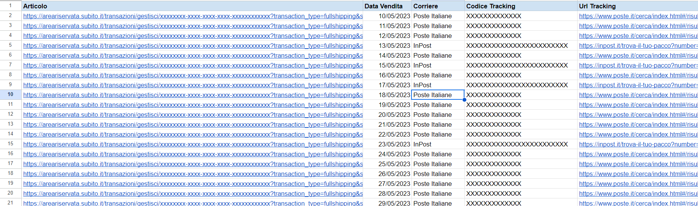

# Subito-it-Articoli-Venduti
Script per estrarre dalle email le vendite effettuate su Subito.it e stamparle su un foglio Google Sheets.

Nella sezione "Vendite" su Subito.it non è possibile vedere tutte le vendite effettuate, ma solo alcune delle più recenti.
Con questo semplice script di Google Apps Script è possibile leggere tutte le email sulla nostra posta di Gmail arrivate da Subito.it e relative alle notifiche delle vendite, estrarre il link della transazione di Subito, la data di vendita, il corriere utilizzato, il codice di tracking del pacco e il link di tracking del corriere e stampare questi dati su un foglio Google Sheet.

Foglio Google Sheets con script: 

https://docs.google.com/spreadsheets/d/11bAUi7g_xZ6w5GxMk8PvxRkrxz3_gufiKrjTFrJ8gO0/copy

## Utilizzo

Per far partire lo script basta andare nelle toolbar in alto e cliccare sull'opzione "Articoli Subito" > "Leggi articoli venduti". 
La prima volta chiederà di fornire l'autorizzazzione allo script per leggere le email.

